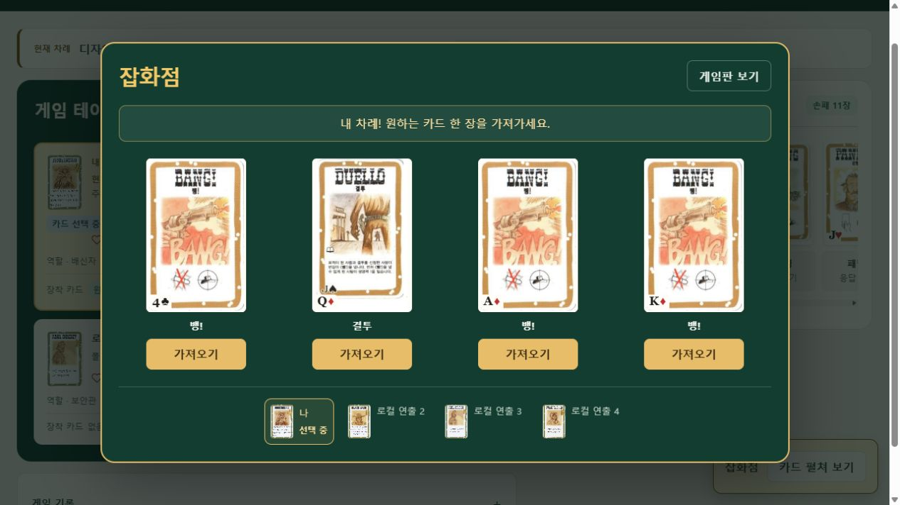

# Animista 기반 게임 연출 보완

## 선택과 구현

공식 Animista의 생성 UI에서 `scale-in-center`, `swing-in-top-fwd`, `shake-horizontal`을 확인했다. 이 게임은 기존 React 상태와 공개 이벤트를 기준으로 연출하므로 필요한 CSS와 브라우저 Web Animations API만 사용한다. Motion/Anime.js의 별도 런타임이나 CDN 호출은 추가하지 않았다.

| 동작 | 적용 | 시간 |
|---|---|---|
| scale-in-center 수정 | 선택 모달, 공개 카드 안내, 결과 등장 | 220–280ms |
| swing-in-top-fwd 수정 | 잡화점 카드가 순서대로 펼쳐짐 | 360ms, 장당 45ms 지연 |
| shake-horizontal 수정 | 피해 좌석, 폭발 좌석 | 380ms, 3px/5px 이동 |
| 좌석 짧은 반응 | 회복·방어·획득·장착·차례·승리 | 360ms |
| 발사/탈락 기존 동작 보완 | 새 이벤트마다 재생, 종료 뒤 원상 복구 | 240ms/480ms |

Animista의 원본보다 작은 크기 변화와 회전 각도를 사용했다. 이름이 같은 이벤트가 연달아 오면 CSS 속성이 유지되어 동작이 다시 시작하지 않는 문제를 새 cue ID마다 Web Animations API를 호출하는 방식으로 수정했다. 좌석과 캐릭터 버튼을 재마운트하지 않아 포커스가 유지된다. 기존 총알 궤적·개틀링·효과음·카드 획득 이동과 함께 동작하며 서버 요청을 기다리게 하거나 조작 완료를 지연시키지 않는다.

연출 설정 또는 OS의 `prefers-reduced-motion`에 따라 CSS와 좌석 동작을 함께 중지한다. OS 설정 변경 이벤트를 구독하고 정리한다. 숨겨진 탭과 컴포넌트 정리 시 활성 동작을 취소하며 미지원/실패는 조작 오류로 전파하지 않는다. 연출을 끄면 총알 레이어의 좌표 측정 및 ResizeObserver 등록도 생략한다.

저작권/FreeBSD(BSD-2-Clause) 공지를 소스에 남겼고 배포 산출물의 `/licenses/animista.txt`에 전체 공지를 포함했다.

## 검증 결과

- 웹 전체 회귀 테스트: **174/174 PASS** (이번 새 연출 테스트 7개 포함). `web-tests.tap` 참조.
- 웹과 Sites TypeScript 검사: **PASS**.
- 생존/탈락자 공개 범위 렌더 fixture: **PASS**.
- Sites 프로덕션 빌드와 배포 산출물 생성: **PASS**.
- React 점검: 애니메이션 cleanup, OS 이벤트 cleanup, public seat만 사용, focus 보존, primitive cue ID 의존성, 런타임 패키지 증가 없음 확인.
- 로컬 4인 방: 준비·시작·역할 확인·게임판 진입, 잡화점 선택, 나머지 3인의 선택 완료 후 모달 종료 확인.
- 브라우저 computed style: 잡화점 `bang-swing-in-top-fwd`, `0.36s`, 지연 `0/45/90/135ms` 확인.
- 연출 끄기: still 클래스 확인, 맥주 사용 후 HP 3→4, 총알 레이어 0개 확인. 켜기로 복원했다.
- 개틀링 사용 및 3명의 실제 TAKE_HIT: 상대 HP 각각 4→3, 응답 종료 후 카드 사용 복구 확인.
- QA fixture는 로컬 D1의 검증용 방에만 적용하고 80장 보존을 확인했다.

## 검증 한계

- 연속 동일 피해 재생/숨김 취소/미지원 처리는 자동 테스트로 확인했다. 브라우저의 읽기 전용 DOM API가 `getAnimations()`를 지원하지 않아 개별 WAAPI 프레임을 브라우저에서 실측했다고 기록하지 않는다.
- OS 동작 줄이기 설정을 실제로 변경하는 브라우저 검증은 실행하지 않았다. 이번 모바일 실측·사람의 효과음 청취·전 인물 전체 게임 플레이도 실행하지 않았다.
- 기존 vinext 개발 환경의 `flushSync` 경고와 빌드의 동적 경로 분류 안내가 남는다.
- 게임 규칙, 공용 명령 계약, API/DB 구조 변경 없음. 서버/Sites 매치 테스트는 이번 CSS/웹 연출 변경에 대해 재실행하지 않았다.
- 원본 수락 집계 **95/97**, **D06/D18/S09 NOT RUN**은 유지한다. 174개 웹 회귀 테스트를 97개 원본 수락 검증으로 대체하지 않는다.

## 공식 참고

- https://animista.net/ — 선택한 CSS를 생성하여 사용하는 방식과 FreeBSD 라이선스.
- https://motion.dev/docs/react-reduce-bundle-size — 대안 검토.
- https://motion.dev/docs/react-accessibility — 동작 줄이기 참고.
- https://animejs.com/documentation/ — 대안 검토.

