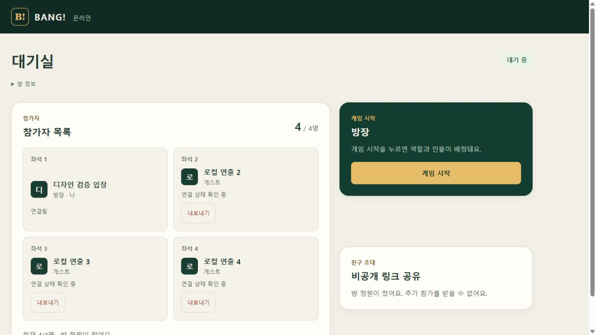

# 입장 자동 준비 및 대기실 단순화

## 적용 정책

2026-10-05 사용자 요청에 따라 **방 입장 자체가 준비**인 서비스 정책 D12를 `outputs/development-plan/01_RULES.md`에 기록했다. 공식 BANG! 턴·카드 규칙 변경은 아니다.

- 준비 완료/준비 취소 버튼과 내 준비 상태 패널 삭제.
- 참가자별 준비 배지와 준비 인원 계산 삭제; 참가자 이름·좌석·연결 상태만 표시.
- 4명 이상이면 정원 내에서 방장이 바로 게임을 시작한다. 4명 미만·비방장·잘못된 버전·진행 중 판·잘못된 좌석 구성은 계속 거절한다.
- 방 생성자와 새 JOIN 참가자를 서버에서 자동 준비로 저장한다. 별도의 SET_READY API 요청이 필요 없다.
- 종료 후 대기실 복귀 시 참가자/좌석을 유지하고 준비를 초기화하지 않는다. 복귀 projection 검증도 이 정책에 맞춰 수정했다.
- Sites D1과 PostgreSQL 모두 시작 처리에서 과거 ready=false를 시작 차단 조건으로 사용하지 않는다. D1 SQL 원자 guard의 준비 조건만 제거하고 인원·정원·방장·버전·좌석·직전 종료 상태 검증을 유지했다.
- 구버전 클라이언트 호환을 위해 SET_READY 계약과 엔드포인트는 유지한다. 이 과거 플래그는 시작 자격을 결정하지 않는다. 화면의 WebMCP 준비 도구는 제거했다.
- DB 스키마나 프로토콜 버전 변경이 필요하지 않다.

## 최종 자동 검증

| 검사 | 결과 |
|---|---|
| 웹 회귀 테스트 | 174/174 PASS |
| Sites 대기실/저장소 테스트 | 30/30 PASS |
| Sites 매치 테스트 | 16/16 PASS |
| PostgreSQL 대기실 생명주기/서비스 테스트 | 30/30 PASS |
| 웹 / Sites / 서버 TypeScript | 모두 PASS |
| Sites build / 배포 산출물 생성 | PASS / PASS |

테스트에는 자동 준비 저장, 레거시 false 플래그로 최초 시작/완료 후 재시작, 3명 거절/7명 시작, 비방장/비회원/오래된 버전 거절, 동시 시작 1회만 저장, 시작 중 좌석 변경 race, 복귀 시 기록 보존/즉시 재시작, 복귀 rollback, 준비 UI/도구 제거가 포함된다.

처음 실행은 이전 정책의 '준비 전 시작 거절' 및 준비 도구 개수 7개라는 테스트 기대값 때문에 실패했다. 사용자 승인 D12에 맞는 긍정·거절 조건으로 테스트를 수정해 재실행했다. 초기 실패 로그도 별도 파일로 보존했다. 통과 항목은 각 최종 테스트 로그에서 확인한다.

## 로컬 브라우저 확인

별도 로컬 검증용 방을 만들어 실제 UI로 이름 입력과 방 생성을 진행했다.

1. 1명 대기실: 준비 버튼/배지 없음, 게임 시작 비활성.
2. 나머지 3명은 JOIN만 제출: 별도 준비 명령 없이 게임 시작 활성.
3. 게임 시작 클릭 → 역할/인물 확인 → 실제 게임판 진입.
4. 로컬 종료 상태 fixture 적용(80장 보존 확인) → 결과 화면 → 실제 RETURN_TO_LOBBY.
5. 복귀한 4인 대기실에서 준비 재설정 없이 게임 시작 → 새 역할 배정 확인.

스크린샷 `lobby.png`는 실제 로컬 4인 대기실이다. 이 검토에 운영 사용자 방이나 운영 DB는 사용하지 않았다.

## 제한

- 종료 화면은 로컬 통제 fixture로 만들었다. 이번 변경에서 전체 자연 플레이를 끝까지 수행했다고 기록하지 않는다.
- 모바일 실측·모든 인물/카드 조합·전체 엔진 테스트를 이번에 새로 실행하지 않았다.
- 기존 vinext 개발 환경 flushSync 경고와 빌드 동적 경로 분류 안내는 남는다.
- 원본 수락 집계 **95/97**, **D06/D18/S09 NOT RUN**은 유지한다. 위 회귀 테스트를 미검증 원본 케이스 통과로 대체하지 않는다.

