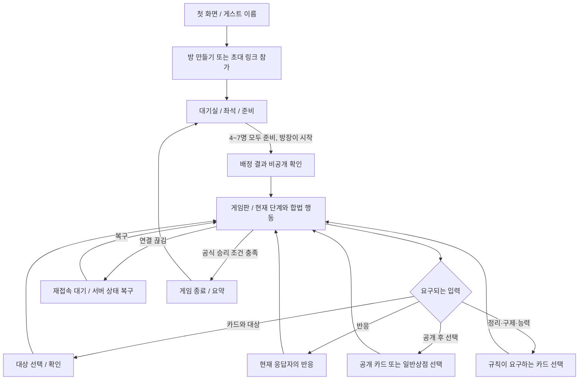

# 뱅! 기본판 온라인 웹게임 제품·UX 계획

> 상태: 기능 계획 초안  
> 범위: 게스트 초대방, 기본판 4~7인, 브라우저 기반 플레이  
> 공식 규칙의 단일 기준: 같은 디렉터리의 `01_RULES.md`와 기본판 FAQ 해석  
> 자산 기준: [`../assets/ASSET_INVENTORY.md`](../assets/ASSET_INVENTORY.md), `asset_manifest.csv`, `extracted_source_manifest.csv`

## 1. 제품 목표와 범위

플레이어가 별도 계정이나 설치 없이 이름을 입력해 방을 만들거나 초대 링크로 참가하고, 4~7명이 같은 게임 상태를 보며 기본판 한 판을 끝낼 수 있는 웹게임을 계획한다. 게임 화면은 현재 합법적인 선택을 분명히 보여 주고, 카드 정보와 역할 정보의 공개 범위를 지켜야 한다. 모바일 브라우저에서도 손패를 읽고, 대상을 고르고, 반응할 수 있어야 한다.

### 첫 버전 포함

- 게스트 표시 이름과 브라우저 세션을 사용하는 입장 흐름
- 비공개 초대 링크/방 코드, 4~7인 대기실, 준비 상태와 시작
- 기본판 역할·인물 배정, 비공개 정보 공개 화면, 게임판, 카드/대상 선택, 반응, 게임 종료
- 방장·참가자의 새로고침 및 연결 복구
- 행동 제한 타이머 없음, 연결 끊김을 탈락으로 처리하지 않는 흐름
- 손패·역할·공개 로그의 비밀성, 모바일 및 키보드/스크린리더 사용성
- 공개 자산은 현재의 22종 플레이 카드 앞면 이미지, 16종 인물 카드, 4종 역할 카드 활용
- 이미지 종류 수와 실제 카드 인스턴스 수를 분리한 80장 플레이 덱 데이터

### 첫 버전 제외

확장판 카드와 규칙, AI 상대, 랭킹·전적, 음성 통화는 범위에 넣지 않는다. 텍스트 채팅은 2단계 기능으로 제안한다. 첫 버전은 게임 플레이에 필요한 시스템 알림과 공개 게임 로그를 제공하고 자유 채팅은 제공하지 않는다.

## 2. 제품 선택과 공식 규칙의 경계

아래 제품 선택은 웹게임의 진입과 상호작용 방식에 관한 것이다. 게임 중 누가 언제 어떤 카드를 쓸 수 있는지, 어떤 플레이어가 대상이 되는지, 효과가 어떤 순서로 해결되는지는 `01_RULES.md`와 기본판 규칙을 해석하는 공식 FAQ를 기준으로 한다. 대회 운영 절차와 대회 전용 변형은 채택하지 않는다. 대회 문서의 일반 FAQ 중 이번 제품에 반영하는 근거는 [BANG! Campionato nazionale, 일반 FAQ pp. 12–14](https://www.dvgiochi.com/bang_champ/MaterialeCampionato/BANG!%20Campionato%20nazionale_Regolamento-daTorneo.pdf)이다. 화면 문구를 편의상 바꾸더라도 규칙 판정을 바꾸지 않는다.

| 주제 | 제품/UX에서 정할 사항 | `01_RULES.md`에서 결정할 사항 |
|---|---|---|
| 진입·방 | 게스트 이름, 초대 링크/코드, 대기실, 준비·방장 버튼 | 게임 규칙에 따른 인원별 역할 구성 및 시작 배정 |
| 화면·입력 | 카드 확대, 키보드/터치 입력, 확인 단계, 복구 화면 | 카드별 법적 사용 시점, 비용, 효과, 제한 |
| 대상·응답 | 합법 대상만 선택 가능하게 표시하고 다중 대상 응답은 차례대로 진행 | 대상 범위·순서, 반응 가능자·순서, 해결/취소 조건 |
| 정보 공개 | 비공개 손패와 공개 이벤트를 다른 UI 영역으로 분리 | 역할·카드·능력별 실제 공개 여부 및 공개 시점 |
| 제한·정리 | 규칙이 요구하는 선택 수를 표시하고 서버가 확인할 때까지 대기 | 손패 상한, 카드 버리기, 탈락 정리 등 수치·순서 |
| 결과 | 종료 시 전체 역할을 공개하고 재대기실로 이동. 살아 있는 플레이어의 손패와 덱은 게임이 끝나도 비공개 유지 | 승리 판정 및 종료 시점 |

클라이언트는 카드 사용 가능 여부, 대상 적법성, 효과 결과를 독자 계산해 확정하지 않는다. 게임 엔진이 보내는 `legalActions`와 현재 단계 정보가 버튼 활성화, 대상 강조, 응답 선택을 결정한다. 특히 효과가 해결되는 중에는 규칙이 연 카드 사용/반응 창 외에 다른 카드를 임의로 사용할 수 없도록 한다.

## 3. 화면 흐름

4~7인에서 테이블 좌석은 화면 폭에 맞춰 재배치한다. 게임 규칙상 종료 판정 및 모든 중간 선택이 끝나기 전에는 결과 화면으로 전환하지 않는다.

## 4. 화면별 요구사항

### 4.1 첫 화면과 게스트 이름

이름 입력 후 `방 만들기` 또는 `초대 링크로 참가`를 선택한다. 이름은 방 안에서 다른 사람에게 보이는 표시 이름이며, 계정 생성·이메일·전화번호 입력은 요구하지 않는다. 앞뒤 공백을 제거한 뒤 1–20 Unicode code point 이름을 허용하고 빈 이름·제한 초과·제어 문자는 거절한다. 같은 이름은 허용하며, 서버가 만든 player ID로 참가자를 구분하고 다른 사람의 이름을 임의로 덮어쓰지 않는다. 이름 입력 오류는 해당 입력 옆에서 설명한다. 화면은 표시 이름을 텍스트로 렌더링해 HTML로 해석하지 않는다. 이 운영 입력 제한은 게임 규칙이 아니다.

브라우저 세션에는 재접속에 필요한 비밀 세션 자격만 보관한다. 초대 URL이나 공개 로그에 그 자격을 넣지 않는다. 사용자가 세션 데이터를 지우거나 다른 브라우저를 쓰면 이름만으로 기존 게임 소유권을 되찾게 하지 않는다.

### 4.2 방 만들기와 초대

방장은 링크 복사와 방 코드 공유를 할 수 있다. 링크를 가진 사람만 참가하는 초대 방식이며 공개 방 탐색은 첫 버전에서 제공하지 않는다. 정원은 최소 4명, 최대 7명이고, 초과 인원은 대기실에 입장시키지 않고 만석 안내를 보여 준다. 게임 시작 후에는 초대 링크로 신규 참가자를 게임 좌석에 합류시키지 않는다.

### 4.3 대기실·준비·시작

대기실은 각 좌석의 이름, 연결 상태, 준비 여부와 방장의 시작 가능 상태를 보여 준다. 방장은 시작 전 참가자를 초대하거나 좌석에서 내보낼 수 있다. 시작 조건을 만족하지 않으면 시작 버튼은 비활성화되고 그 이유가 텍스트로 안내된다. 정원과 모든 필수 참가자 준비 상태가 충족되면 방장에게 시작 동작을 제공한다. 정확한 시작 배정과 순서는 `01_RULES.md`를 따른다.

게임이 시작되는 순간 좌석 목록을 고정한다. 게임 진행 중 방장은 참가자를 강제 퇴장시킬 수 없다. 참가자가 연결을 잃어도 사망/탈락으로 바꾸거나 연결 손실을 이유로 좌석에서 제거하지 않는다.

### 4.4 역할·인물 확인

서버가 배정한 역할과 인물 가운데 규칙상 비공개인 정보는 해당 플레이어만 볼 수 있는 확인 화면에서 보여 준다. 공개 역할은 규칙상 정해진 시점부터 테이블의 공개 영역에 표시한다. 역할 카드 및 인물 카드의 이미지, 한국어 이름, 설명 텍스트를 제공하고 `확인하고 게임판으로` 버튼을 둔다. 다른 플레이어가 비공개 카드를 먼저 확인했는지는 공개 정보로 만들지 않는다. 공개 여부와 시점은 `01_RULES.md`의 정보 공개 규칙에 따른다.

카드 확대 보기에는 그림과 별개로 역할/인물명과 능력 설명을 읽을 수 있는 텍스트로 함께 둔다. 화면 공유나 보조기술에서 남의 비밀 정보를 가져오지 않도록 현재 세션 소유자의 비공개 정보만 API 응답에 포함한다.

### 4.5 게임판

게임판에는 현재 차례/해결 단계, 플레이어 좌석 4~7개, 공개 생명력·장착 상태·공개 역할, 각 플레이어의 손패 장수, 덱의 카드 수, 버림더미 맨 위 카드와 전체 장수, 공개 게임 로그를 배치한다. 버림더미를 눌러 전체 카드를 열람하는 화면은 제공하지 않는다. 각 항목이 공개되는지는 `01_RULES.md`에서 정의한 공개 범위를 따른다. 상대 손패는 카드 앞면이 아니라 장수만 표시하고, 비공개 역할과 덱 순서를 추정할 수 있는 데이터를 UI·로그·접근성 트리에서 노출하지 않는다. 버림더미 정보 표시 제한은 [공식 기본판 FAQ 해석](https://www.dvgiochi.com/bang_champ/MaterialeCampionato/BANG!%20Campionato%20nazionale_Regolamento-daTorneo.pdf)을 따른다.

현재 행동을 요구받는 참가자는 강조 테두리와 명확한 문구를 함께 받는다. 단지 색상이나 애니메이션으로 차례를 알리지 않는다. 현재 서버 단계가 응답 또는 다른 참가자의 선택을 기다리는 중이면 차례가 아닌 플레이어에게 일반 행동 버튼을 열지 않는다.

### 4.6 카드 손패·확대·행동

손패 카드는 모바일에서 좌우 스크롤할 수 있고, 터치 한 번으로 바로 실행되지 않게 `카드 선택 → 합법 대상/선택 확인 → 실행` 흐름을 둔다. 데스크톱은 클릭·키보드 선택이 가능하다. 카드 확대 패널에는 카드명, 이미지, 권위 있는 rank/suit, 한국어 카드 텍스트, 사용할 수 있는 경우의 대상/효과 범위를 표시한다. 카드 하나를 확대해도 손패 수나 현재 단계가 가려지지 않게 한다.

사용 가능한 카드와 대상만 `legalActions` 결과로 활성화한다. 사용 불가 카드는 이유를 설명할 수 있는 경우 짧은 이유를 보여 주되 숨은 역할·상대 패·덱 상태 같은 비밀 정보로 이유를 설명하지 않는다. 취소는 서버에서 실행되기 전까지만 허용한다. 효과 해결이 시작되면 규칙에서 허용한 현재 반응 선택만 남긴다.

### 4.7 대상 선택과 다중 대상 응답

대상 선택은 합법 대상만 강조하고, 선택된 대상의 이름과 선택한 카드/효과를 확인 화면에 함께 표시한다. Panic!/Cat Balou는 손패 영역을 고르면 서버가 대상 손패에서 무작위 1장을 처리하고, 공개 장착 영역을 고르면 카드를 낸 플레이어가 공개 카드 1장을 직접 고른다. 대상 플레이어에게 장착 카드를 고르는 응답창을 열지 않는다. 이는 S1 규칙서 “The Symbols”의 “choose one in play in front of him” 설명을 따른다. 기본판 FAQ p.12에 따라 패닉/캣 벌로우는 자기 자신을 대상으로 할 수 있다. 다만 자기 손패는 대상으로 고르지 못하며, 자기 앞 테이블의 카드 가운데 `legalActions`가 허용한 항목만 표시한다. 자기 대상 선택을 막는 전역 필터는 두지 않는다. [공식 FAQ](https://www.dvgiochi.com/bang_champ/MaterialeCampionato/BANG!%20Campionato%20nazionale_Regolamento-daTorneo.pdf).

한 효과가 여러 플레이어에게 차례로 응답을 요구하면 동시에 모든 대상에게 응답 버튼을 열지 않는다. `1/N` 단계 표시, 현재 대상의 이름, 지금 해결 중인 효과, 그 사람에게 가능한 응답/선택만 보여 준다. 현재 응답이 서버에서 확정된 후 다음 대상에게 차례를 넘긴다. 한 번의 전체 공격으로 여러 플레이어가 탈락할 수 있으면, 마지막 대상의 효과까지 해결한 뒤에 승리 조건을 판정한다. 연결 복구 시 현재 대상과 이미 끝난 대상, 남은 응답 수를 서버 스냅샷으로 복원한다. 실제 대상 순서와 통과/해결 조건은 `01_RULES.md`에 정의한다. 전체 공격 후 승리 판정은 [공식 FAQ p.13](https://www.dvgiochi.com/bang_champ/MaterialeCampionato/BANG!%20Campionato%20nazionale_Regolamento-daTorneo.pdf)을 따른다.

Slab the Killer의 BANG!에 대한 응답은 한 번에 한 장의 `Missed!`를 선택하도록 한다. 대상 플레이어는 Missed 한 장만 내고도 응답할 수 있지만, 뒤이어 추가 효과가 해결되지 않으면 그 한 장만으로 공격을 피하지 못하고 피해를 받는다. Suzy Lafayette가 손에 남은 마지막 Missed를 이 공격에 사용하면 그 직후 카드를 한 장 뽑는다. 뽑은 카드가 Missed이면 두 번째 응답 창을 바로 열어 즉시 사용할 수 있게 하며, 이 후속 Missed로 공격을 막을 수 있다. 자동으로 두 장을 한 묶음으로 버리거나 결과를 선판정하지 않는다. 사용자 선택과 각 효과 사이의 전이는 `legalActions` 및 `01_RULES.md`에 맡긴다. [공식 FAQ p.14](https://www.dvgiochi.com/bang_champ/MaterialeCampionato/BANG!%20Campionato%20nazionale_Regolamento-daTorneo.pdf).

### 4.8 맥주 구제 및 생명력 변화

생명력이 0이 되는 상황에서 규칙상 생존 구제가 가능한 플레이어에게만 구제 화면을 띄운다. 규칙이 요구하는 맥주 사용 선택을 분명히 표시하고, 다른 행동은 그 선택이 해결될 때까지 잠근다. 행동 제한 타이머가 없으므로 응답 미입력만으로 자동 통과·탈락시키지 않는다. 구제 성공 여부, 남은 생명력, 효과 종료를 즉시 상태와 공개 로그에 반영한다.

공식 FAQ에서 맥주는 이미 생명력이 가득 찬 때에도 사용할 수 있고 효과가 없으며, 생존자가 2명뿐인 상황에도 사용할 수 있지만 회복 효과가 없다고 안내한다. 엔진의 `legalActions`가 이 사용을 허용하면 UI에서 막지 않는다. 실행 전에는 해당 상황에서 회복 결과가 없다는 짧은 확인 문구를 제공하되, 플레이어의 명시적 선택을 그대로 처리한다. 카드 사용의 정확한 타이밍·구제 조건은 `01_RULES.md`를 따른다. 출처: [공식 기본판 FAQ](https://www.dvgiochi.com/bang_champ/MaterialeCampionato/BANG!%20Campionato%20nazionale_Regolamento-daTorneo.pdf).

### 4.9 Sid Ketchum 능력

Sid Ketchum은 16종 인물 목록 안에서 식별되는 인물이며, 인물 능력을 게임판의 `인물 능력` 액션으로 찾아 쓸 수 있어야 한다. Sid의 능력은 상대 차례의 마지막 생명력 구제에도 사용할 수 있으며, 자신 차례를 포함해 규칙상 맥주를 합법적으로 낼 수 있는 시점에만 제공한다. 다른 카드의 효과가 해결되는 도중에는 사용할 수 없다. `01_RULES.md`와 서버의 `legalActions`가 허용할 때만 활성화한다. 카드 선택형 능력은 서버가 요구하는 수의 손패를 선택·확인해 제출한다. 조건·사용 횟수·허용 단계·결과는 정본과 일치시킨다. 선택 중 취소/복귀 시 상태를 중복 제출하지 않는다. [공식 FAQ p.14](https://www.dvgiochi.com/bang_champ/MaterialeCampionato/BANG!%20Campionato%20nazionale_Regolamento-daTorneo.pdf).

### 4.10 일반상점과 공개 선택

일반상점은 공개된 카드 선택 영역으로 렌더링한다. 현재 선택권을 가진 사람과 선택해야 할 카드 수를 표시하고, 선택이 확정된 카드 슬롯은 즉시 채워졌거나 선택 불가로 표시한다. 다음 선택자는 앞선 선택이 반영된 공개 상태를 보고 선택한다. 선택이 다른 참가자와 동시에 확정되는 경합을 만들지 않는다. 카드 수·선택 순서·획득 후 상태는 `01_RULES.md` 기준이다.

### 4.11 뽑기와 카드 공개의 구분

손패에 들어가는 일반 뽑기, 덱 위 카드를 공개하는 효과, 공개된 카드에서 선택하는 일반상점/선택 효과를 UI 이벤트로 구분한다. 일반 뽑기는 기본적으로 카드 앞면을 뽑은 플레이어에게만 보여 주고, 모두에게는 규칙상 공개 가능한 뽑기 장수/이벤트만 알린다. 공개 효과는 카드 앞면이 공개 영역에 놓이는 시점과 공개 후 그 카드가 손패/버림/선택 영역으로 이동하는 시점을 별개로 기록한다.

로그 문구도 `손패로 뽑음`, `덱 위 카드 공개`, `공개 카드 선택`을 서로 바꾸어 쓰지 않는다. 공개된 카드를 손에 넣는 효과라면 공개 단계와 획득 단계를 둘 다 표시하고, 비공개 드로우를 공개한 것처럼 보이게 하지 않는다. 이때의 대상·공개 시점·카드가 이동하는 위치는 `01_RULES.md`를 따른다.

### 4.12 손패 정리·임의 버리기 금지

손패 정리 단계에서는 규칙 기준 손패 상한, 현재 손패 수, 선택해야 할 버림 수를 계산된 서버 값으로 보여 준다. 플레이어가 해당 수의 카드를 직접 고르고, 여러 장을 버리는 경우 버림 순서도 직접 정한다. 네트워크 타임아웃이나 브라우저 상태 변화로 서버가 임의 카드를 버리지 않는다. 사용자가 별도의 카드 효과를 선택하는 경우에도 엔진이 제공한 법적 선택만 표시하고, 단순히 현재 손패를 줄이려고 임의로 버리는 기능은 제공하지 않는다.

일반 손패 정리의 정확한 상한과 타이밍은 `01_RULES.md`를 기준으로 한다. 카드가 규칙상 버려지거나 선택되어야 하면 실제 카드를 선택하는 인터랙션이 필요하다. 자동 선택은 허용하지 않는다.

### 4.13 탈락 처리와 카드 버리기 순서

탈락 후 카드 정리 단계에서 탈락한 플레이어가 자신의 손패/테이블 카드를 어떤 순서로 버릴지 직접 고르게 한다. 자기 차례에 여러 장을 버리는 경우에도 적용한다. 공식 기본판 FAQ 기준으로 서버는 카드의 임의 순서를 자동으로 만들지 않는다. 선택 UI는 남은 카드 목록을 차례로 표시하고 다음 버릴 카드를 제출받는다. 공개 로그에는 규칙상 필요한 탈락 사실과 카드 수를 기록하고, 공개되지 않는 카드 앞면은 다른 참가자에게 노출하지 않는다. [공식 FAQ pp. 12–14](https://www.dvgiochi.com/bang_champ/MaterialeCampionato/BANG!%20Campionato%20nazionale_Regolamento-daTorneo.pdf).

정리 도중 탈락 플레이어가 연결을 잃으면 동일 세션 재접속 시 현재 선택 단계와 남은 카드 목록을 복원하고 게임 진행은 선택 해결을 기다린다. 자동 버림·자동 건너뛰기·게임 중 방장 킥으로 이 입력을 대체하지 않는다. 구체적인 공개 범위 및 보상/승리 처리는 `01_RULES.md`를 따른다. 탈락 및 자기 차례 중 여러 장 버리기의 순서 선택은 [공식 기본판 FAQ pp. 12–14](https://www.dvgiochi.com/bang_champ/MaterialeCampionato/BANG!%20Campionato%20nazionale_Regolamento-daTorneo.pdf)를 따른다.

### 4.14 종료·결과

공식 승리 조건이 서버에서 확정되면 진행 중인 모든 선택을 닫고 종료 요약을 표시한다. 온라인 종료 정책으로 모든 참가자의 역할을 공개한다. 살아 있는 플레이어의 손패와 덱 순서는 게임 종료 후에도 비공개로 남긴다. 요약에는 우승 진영/플레이어, 게임 종료 이유, 공개 로그를 제공한다. 방장은 `대기실로 돌아가기`를 선택할 수 있다. 이 동작은 진행 중 매치를 중단하지 않고 종료된 매치만 같은 roster의 대기실로 돌리며 모든 참가자의 ready를 해제한다. 참가자는 각자 다시 준비하고 방장이 시작해야 한다. 다른 참가자는 서버 동기화 뒤 같은 대기실로 이동한다. 대기실을 거치지 않는 직접 재시작은 종료된 매치와 동일 roster 및 전원 ready 상태에서만 허용하고, 새 게임 세션·매치 ID를 만든다. 어느 경로도 이전 매치의 비밀 상태를 재사용하지 않는다. 기존 방을 계속 쓰지 않으려면 새 방을 만들 수 있다.

### 4.15 재접속

연결이 끊기면 화면 상단에 `연결 끊김 · 재접속 시 현재 판을 복구합니다` 같은 상태를 표시한다. 서버의 마지막 확정 게임 상태, 활성 입력 단계, 자신의 비공개 손패와 대기 중인 선택만 복구한다. 재접속 전 제출이 처리됐는지 모호한 동작은 클라이언트 재전송 키/서버 응답으로 한 번만 적용한다.

연결 끊김 자체는 사망·탈락·자동 패스·자동 카드 버리기·퇴장으로 바꾸지 않는다. 게임 중 방장의 참가자 강제 퇴장도 허용하지 않는다. 첫 버전에는 응답 기한이나 행동 제한 타이머가 없다. 사용자가 브라우저를 닫아도 서버의 현재 입력 단계는 보존하고, 기존 비밀 세션으로 재접속하면 그 단계부터 진행한다.

## 5. 공개/비공개 정보와 로그

| 정보 | 해당 플레이어 본인 | 다른 참가자 | 로그 원칙 |
|---|---|---|---|
| 본인 손패 앞면 | 표시 | 숨김 | 카드 공개 여부가 규칙상 허용될 때만 앞면 기록 |
| 상대 손패 | 장수만 표시 | 장수만 표시 | 장수 변화 등 공개 가능한 결과만 기록 |
| 본인 비공개 역할/인물 | 표시 | 규칙이 공개하기 전에는 숨김. 게임 종료 시 역할은 전체 공개 | 사전 로그·브라우저 저장소·오류 메시지에 노출 금지 |
| 공개된 역할·테이블 카드 | 표시 | 표시 | 공개 시점 이후 기록 |
| 버림더미 | 맨 위 카드와 전체 장수 표시 | 맨 위 카드와 전체 장수 표시 | 전체 목록/검색/열람 UI를 제공하지 않음 |
| 덱 순서/미공개 카드 | 카드 앞면을 공개할 효과만 표시 | 카드 앞면과 순서 숨김 | 게임 종료 후에도 숨김 |
| 일반 드로우 | 뽑은 본인에게 카드명 표시 | 앞면 숨김 | 공개 가능한 장수/행동만 기록 |
| 덱 위 공개 및 일반상점 | 공개 카드 앞면 표시 | 공개 카드 앞면 표시 | 공개와 획득 단계를 따로 기록 |
| 합법 행동 | 본인 화면에 구체적 선택 표시 | 타인에게 비밀 행동 가능성을 암시하지 않도록 주의 | 완료된 공개 행동만 상세 기록 |
| 타겟/응답 대기 | 입력할 사람에게 현재 선택 표시 | 공개 범위에 따라 현재 효과 단계 표시 | 다음 차례/결과를 선공개하지 않음 |

서버가 플레이어별 응답을 만들고 클라이언트는 그 응답만 렌더링한다. 숨긴 역할/손패를 공개하는 잘못된 로그, 오류 세부 정보, HTML 접근성 라벨, 브라우저 타이틀, 알림 미리보기는 개인정보 누출로 본다. 공개 게임 로그는 자유 채팅을 대신하지 않으며, 규칙상 공개된 행동의 간단한 시간순 피드다. 로그를 버림더미 전체 목록이나 카드별 검색·열람 화면으로 만들지 않는다. 게임 종료 시 역할 공개는 허용하지만 살아 있는 손패 및 덱의 앞면/순서는 공개하지 않는다.

## 6. 80장 플레이 덱과 카드 이미지 렌더링 명세

### 6.1 에셋 수와 카드 데이터 수

현재 `ASSET_INVENTORY.md`와 `asset_manifest.csv` 기준으로 카드 앞면 그림은 플레이 카드 22종, 인물 16종, 역할 4종으로 총 42개다. `cards/playing/`의 파일 하나는 카드 **종류의 그림 템플릿**이며 물리 카드 한 장을 나타내지 않는다. 플레이 카드 종류별 매니페스트 수량 합은 80장이다. 역할 카드 이미지 4종도 각 역할의 그림 템플릿이며 역할 매니페스트의 복사 수는 합계 7장이다. 캐릭터 이미지는 각 1장인 16종이다.

따라서 게임 데이터는 22개 플레이 카드 타입과 80개 별도 카드 인스턴스를 가져야 한다. `assetKey`로 타입 이미지에 연결하고 `cardInstanceId`로 덱 안의 각 실물 카드를 추적한다. 인스턴스에는 공식 기본판 카드 목록에서 확인한 개별 `rank`와 `suit`를 저장한다. 같은 타입의 카드가 여러 장이어도 인스턴스 ID는 다르며, rank/suit 조합은 공식 목록이 허용하는 경우에만 중복될 수 있다. 인물 및 역할은 각각 별도 ID와 데이터 모델을 두고 플레이 카드 rank/suit로 취급하지 않는다.

권장 플레이 카드 데이터 필드:

| 필드 | 의미 |
|---|---|
| `cardInstanceId` | 80장 각각의 안정된 고유 식별자 |
| `cardTypeId` | 22개 카드 종류 중 하나 |
| `assetKey` | `cards/playing/` 이미지 템플릿 키 |
| `rank` | 공식 카드 목록의 A, 숫자, J/Q/K 등 값 |
| `suit` | 공식 카드 목록의 하트/다이아/클럽/스페이드 값 |
| `deckOrder` 또는 셔플 seed 연결 | 서버에서만 사용하는 덱 순서 관리 필드 |

실제 80장의 rank/suit 매핑은 이미지에 인쇄된 숫자나 그림을 읽어 추정하지 않는다. 각 카드 인스턴스와 값의 데이터 정본은 `data/base-deck.json`으로 두고, `01_RULES.md`는 카드 목록의 공식 규칙 해석과 정확성을 뒷받침한다. 데이터의 타입별 수량은 `asset_manifest.csv`와 대조한다. 누락·중복·개수 오류가 없는지 런타임에 검증하며, 계획 문서만으로 알 수 없는 rank/suit를 임의로 채우지 않는다.

### 6.2 인쇄된 rank/suit 오표시 방지

타입 이미지에는 그 이미지가 대표하는 인쇄 rank/suit가 이미 보인다. 같은 카드 타입의 실제 80장 인스턴스와 인쇄된 표기가 다를 수 있으므로, 원본 이미지를 그대로 카드 앞면으로 표시하면 실제 카드 정보와 그림이 충돌한다. 인스턴스 데이터가 **유일한 rank/suit 권위값**이며, 카드 표시 계층은 원본 이미지의 옛 rank/suit를 그대로 노출하면 안 된다.

구현 명세:

1. 원본 PNG는 출처/검수를 위해 보존한다. 게임 카드 컴포넌트는 원본을 배경 레이어로 사용하되, `cardTypeId`별로 기존 rank/suit가 인쇄된 모서리 영역을 덮는 마스크를 적용한다.
2. 마스크 좌표는 카드 이미지마다 원본 자르기와 종횡비가 다르므로 `assetKey`별 상대 좌표(0~1) 또는 정규화한 별도 변환본에 기록한다. 현 미리보기에서는 다수 플레이 카드의 기존 표기가 왼쪽 아래에 보이나, 전 파일을 확인해 마스크 경계를 확정해야 한다.
3. 마스크 안에는 카드 테두리와 잘 어울리는 단색/프레임을 사용해 원래 숫자·무늬를 완전히 가린다. 글자를 흐리게 덮거나 그 위에 작은 숫자를 겹쳐 읽을 수 있게 만드는 방식은 쓰지 않는다.
4. 마스크 위에 인스턴스의 `rank`와 `suit`를 같은 크기와 위치 규칙으로 새로 그린다. rank, 무늬 모양, 색상, 스크린리더용 한글 대체 텍스트를 함께 제공하고 색만으로 무늬를 구별하지 않게 한다.
5. 축소 손패, 카드 확대 모달, 드래그/선택 프리뷰, 공개 로그의 카드 앞면 모두 같은 렌더러와 동일한 인스턴스 값을 사용한다. 한 화면에서 이미지 원표기와 overlay가 달라 보이는 상태를 허용하지 않는다.
6. 마스크가 불가능한 카드 타입은 게임 플레이 전에 별도 정규화된 파생 렌더 자산을 만든다. 원본 에셋을 비파괴 보존하고, 공개 카드가 소유 카드와 다른 rank/suit처럼 보이지 않는지 검토한다.

카드 뒷면, 플레이어 보드, 요약 카드, 총알 토큰, 표준 무늬 아이콘, 테이블 배경은 현 매니페스트에서 확보되지 않았다. 이 UI 조각은 자체 CSS/SVG 그래픽으로 제작한다. 공식 로고/워드마크는 별도 권한 범위가 확인된 경우만 쓴다. 기존 카드 에셋 출처와 권한 메모는 `outputs/assets/ATTRIBUTION.md`를 따른다.

## 7. 모바일·접근성·입력 기준

- 뷰포트가 좁으면 원형 테이블을 세로형 좌석 목록으로 바꾸고, 현재 플레이어/대상/요청 단계는 손패 위 고정 영역에 둔다. 좌석 수는 4~7에 맞춰 동적으로 재배치한다.
- 손패는 세로 공간을 과하게 차지하지 않게 가로 스크롤하고, 선택 상태를 카드 테두리·아이콘·텍스트로 표시한다. 확대 모달은 닫기/선택/취소를 키보드와 터치로 조작할 수 있다.
- 주요 터치 컨트롤은 약 44 CSS px 이상의 입력 영역을 목표로 하고, 인접 버튼 오입력을 줄인다. 브라우저 확대와 운영체제 글자 확대에서 정보가 잘리거나 버튼이 겹치지 않도록 한다.
- 상태 변화는 색과 애니메이션에만 맡기지 않고 텍스트, 아이콘 모양, 라벨을 함께 제공한다. 하트/다이아/클럽/스페이드의 색이 비슷하거나 색각 차이가 있어도 구분할 수 있어야 한다.
- 버튼은 의미 있는 이름과 현재 상태를 스크린리더에 제공한다. 새로운 차례, 응답 요청, 오류, 선택 완료는 적절히 안내하되, 비밀 카드/역할을 공개 채널에 잘못 읽어 주지 않는다.
- 애니메이션 줄이기 설정을 존중한다. 카드 이동 효과가 필요한 정보 전달을 대체하지 않으며, 사용자는 모션 없이도 이동 결과를 알 수 있어야 한다.
- 카드 이미지는 보조기술에서 `카드명, rank, suit`를 별도 텍스트로 읽을 수 있게 한다. 공개/비공개는 화면 시각 상태뿐 아니라 접근성 트리와 API 경계 모두에서 유지한다.

## 8. 기능 요구사항 ID와 수락 조건

| ID | 요구사항 | 수락 조건 |
|---|---|---|
| UX-001 | 기본판 4~7인 초대 게임 | 4명 미만 시작은 거부되고, 4~7명은 방 좌석 수에 맞춰 대기할 수 있으며 8번째 참가자는 입장되지 않는다. 확장·AI·랭킹·음성은 첫 버전 화면에 노출되지 않는다. |
| UX-002 | 게스트 이름과 세션 | 이름을 입력해 계정 없이 방에 들어간다. 같은 브라우저 세션 재접속 시 동일 좌석을 복구하고, 이름만으로 타인의 게임 상태를 획득할 수 없다. |
| UX-003 | 초대방 | 방 생성 후 공유 가능한 코드/링크가 제공된다. 게임 시작 후 신규 플레이어는 중간 입장할 수 없다. 만석 시 이유와 돌아가기 경로를 제공한다. |
| UX-004 | 준비/시작 | 각 좌석의 준비 상태와 방장 권한이 보인다. 시작 조건을 충족하지 않으면 시작이 되지 않고, 충족하면 방장의 명시적 입력으로 한 번만 시작된다. |
| UX-005 | 역할/인물 확인 | 규칙상 비공개 배정은 소유자 화면/API에만 포함되고, 공개 배정은 규정한 시점부터 공개된다. 다른 세션의 브라우저 검사, 로그, 스크린리더 레이블에서 비공개 배정이 나오지 않는다. |
| UX-006 | 4~7인 게임판 | 현재 단계, 현재 입력자, 공개 플레이어 상태, 손패 장수, 공개 영역을 구분해 보여 준다. 비공개 카드 앞면은 소유자 외에 노출되지 않는다. |
| UX-007 | 카드 확대 | 손패/테이블 카드 확대에서 이름·설명·합법 행동/대상과 인스턴스의 권위 rank/suit를 확인할 수 있고, 확대 후 이전 화면으로 돌아갈 수 있다. |
| UX-008 | 합법 행동 선택 | 플레이·반응/대상 버튼의 활성 여부가 `legalActions`와 일치한다. 해결 중 다른 카드를 임의로 실행할 수 없고, 부적법한 조작은 서버가 거부한다. |
| UX-009 | 대상 선택 | 합법 대상이 명시된다. 패닉/캣 벌로우의 선택 대상에서 자기 손패는 제외한다. 자기 테이블 카드는 `01_RULES.md`와 `legalActions`가 허용할 때만 선택할 수 있고, 전역 본인 제외 필터가 허용된 자기 대상까지 숨기지 않는다. |
| UX-010 | 다중 대상 순차 응답 | 여러 응답자가 필요한 효과에서 현재 한 명에게만 응답 입력을 열고, 서버가 확정한 뒤 다음 사람으로 이동한다. 단일 전체 공격으로 여러 명이 탈락하면 모든 대상의 효과가 끝난 뒤 승리 조건을 확인한다. 재접속해도 완료/대기 단계가 정확하다. |
| UX-011 | 맥주 구제 | 규칙상 가능한 구제 단계가 나타나고, 해당 맥주 선택 후 엔진 결과가 반영되기 전 다른 행동을 실행하지 못한다. FAQ상 효과 없는 사용도 `legalActions`가 허용하면 거부하지 않고 결과가 없음을 미리 설명한다. |
| UX-012 | Sid Ketchum 능력 | Sid 능력은 맥주를 합법적으로 사용할 수 있는 타이밍에만 `legalActions`로 나타나며, 상대 차례 치명상 구제에 사용할 수 있다. 다른 카드 해결 도중에는 열리지 않는다. 비용 선택과 결과가 `01_RULES.md`와 일치한다. |
| UX-013 | 일반상점 | 공개된 선택 카드와 순차 선택 상태가 보인다. 앞선 선택이 반영된 뒤 다음 사람의 선택을 연다. 동시 선택 경합이 없다. |
| UX-014 | 뽑기와 공개 분리 | 비공개 손패 뽑기, 덱 위 카드 공개, 공개 카드 선택이 화면·로그·상태 전이에서 구별된다. 비공개 뽑기의 앞면은 규칙상 공개되지 않는 플레이어에게 보이지 않는다. |
| UX-015 | 손패 정리 | 서버에서 받은 상한과 버릴 수를 표시하고 플레이어가 직접 고른다. 여러 장이면 버릴 순서도 직접 정한다. 규칙상 허용되지 않는 임의 버리기를 제공하지 않는다. |
| UX-016 | 카드 버리기 순서 선택 | 탈락하거나 자기 차례에 여러 장을 버리는 플레이어가 직접 순서를 고른다. FAQ 입력이 끝나기 전 자동 순서, 자동 스킵, 자동 버림이 일어나지 않고 재접속 시 선택을 복원한다. |
| UX-017 | 결과 | 서버에서 게임 종료가 확정된 뒤 모든 역할을 공개한다. 살아 있는 플레이어의 손패와 덱은 끝난 뒤에도 비공개로 남는다. 승리 판정은 `01_RULES.md`와 일치하고 새 게임은 별도 상태로 시작한다. |
| UX-018 | 재접속 | 새로고침/일시 네트워크 손실 후 서버 확정 상태와 현재 응답 단계를 복구한다. 연결 손실은 탈락, 자동 패스, 카드 버림, 강제 퇴장으로 처리되지 않는다. |
| UX-019 | 무타이머/방장 제어 | 첫 버전에 행동 제한 타이머와 시간초과 자동 행동이 없다. 게임 중 방장에게 참가자를 강제 퇴장하는 컨트롤이 없다. |
| UX-020 | 공개/비공개 로그 | 공개 행동만 짧은 로그에 나오며 비공개 손패·숨은 역할·덱 정보가 누출되지 않는다. 뽑기와 공개 후 획득을 구별하고 버림더미 전체 목록/검색을 제공하지 않는다. |
| UX-021 | 80장 덱 식별 | 22종 타입 이미지에 대응하는 80개 고유 `cardInstanceId`를 `data/base-deck.json`에서 확인한다. 타입별 매니페스트 수량은 80과 일치하고 각 카드의 rank/suit는 검증 가능한 정본과 일치한다. |
| UX-022 | rank/suit 표시 정합성 | 모든 표시 크기/위치에서 원본 타입 이미지의 인쇄 rank/suit가 읽히지 않고, 해당 카드 인스턴스의 overlay 값이 이미지·로그·확대 보기에서 일치한다. |
| UX-023 | 자체 UI 에셋 | 뒷면, 기본 아이콘/토큰, 보드/테이블 UI는 자체 그래픽 또는 허용된 에셋으로 표현하며, 미확보 자산을 있다고 가정하지 않는다. |
| UX-024 | 모바일·접근성 | 4~7인 모바일 화면에서 조작이 가능하고 가로 잘림이 없다. 키보드로 주요 흐름을 완료할 수 있고, 차례·선택·오류·카드 정보에 텍스트 대안이 있다. |
| UX-025 | 자유 채팅 2단계 | 첫 버전에서 채팅 입력창이나 음성 연결 기능을 제공하지 않는다. 시스템 게임 로그/행동 피드와 채팅을 시각적으로 구별한다. |
| UX-026 | 버림더미 열람 제한 | 게임 중 버림더미는 맨 위 카드와 전체 장수만 보인다. 클릭/확대/접근성 트리/로그 검색으로 전체 카드 목록을 만들 수 없다. |
| UX-027 | Slab·Suzy 방어 | Slab의 BANG!에서 Missed는 한 장 단위로 낼 수 있고, 한 장만 냈으며 추가 효과가 없으면 피해를 받는다. Suzy가 마지막 Missed를 쓰면 즉시 한 장을 뽑고, 그 카드가 Missed이면 두 번째 응답 창을 열어 즉시 방어할 수 있다. |
| UX-028 | 게임 종료 정보 | 결과 화면에서 모든 역할을 공개한다. 살아 있는 손패와 덱 앞면/순서는 게임 종료 후에도 비공개다. |

## 9. 주요 UI 상태 카탈로그

| 상태 | 사용자에게 보이는 상태 | 허용되는 입력 |
|---|---|---|
| 이름 입력 | 이름, 방 만들기/초대 참가 | 이름 수정, 경로 선택 |
| 대기실 | 좌석, 초대 정보, 준비, 시작 가능 조건 | 준비 변경, 방장 시작, 로비에서 방장 관리 |
| 배정 공개 | 본인 역할/인물 카드 및 설명 | 확대, 확인 |
| 내 행동 차례 | 서버 제공 합법 행동, 손패/대상 | 해당 행동 선택 |
| 대상 선택 | 합법 대상 강조, 선택한 효과 | 대상 선택, 확인/취소(실행 전) |
| 응답 대기 | 자신이 응답자인지와 허용 응답 | `legalActions`에서 제공한 응답만 |
| 다른 사람 입력 대기 | 현재 해결 중인 단계와 입력자 | 관전/공개 로그 확인; 임의 게임 행동 불가 |
| 공개 카드 선택 | 카드 앞면과 선택 순서 | 현재 선택자의 선택만 |
| 손패 정리 | 상한, 보유 장수, 선택 수 | 요구된 카드 수 선택 후 제출 |
| 구제 대기 | 가능한 구제와 보유한 합법 카드 | 서버가 허용한 구제 선택 |
| Slab 응답 | 현재 BANG! 대상, Missed 1장 응답 상태 | 카드 한 장 단위의 합법 응답/통과 |
| Suzy 후속 방어 | 마지막 Missed 뒤 즉시 뽑은 카드와 효과 대기 | 추가 Missed가 합법일 때 후속 방어 선택 |
| 탈락 카드 정리 | 다음 버림 카드 입력 요청, 남은 정리 수 | 탈락 플레이어가 직접 순서 선택 |
| 연결 끊김 | 재연결 상태와 현재 판 복구 안내 | 재시도, 동일 세션 복귀 |
| 게임 종료 | 결과, 모든 역할 공개, 살아 있는 손패/덱 비공개, 요약 | 새 대기실/새 방으로 이동 |

## 10. 남은 정본화 작업과 의존성

1. `01_RULES.md`에 게임 흐름, 4~7인 역할 구성, 각 카드와 Sid Ketchum 능력, 구제/종료/정리/공개 범위, 대상 및 반응 순서를 정리한다. `BANG! Campionato nazionale_Regolamento-daTorneo.pdf`의 기본판 일반 FAQ pp. 12–14는 해석 참고로 채택하고, 대회 운영 절차·대회 전용 변형은 제외한다. 이 문서는 자기 대상 Panic/Cat Balou, 전체 공격 후 승리 판정, 버림더미 접근, Sid, Slab/Suzy 예외를 UX의 정본 동작으로 참조한다.
2. `data/base-deck.json`을 공식 기본판 플레이 카드 80장의 인스턴스와 rank/suit 정본으로 사용하고, `asset_manifest.csv`의 타입별 수량과 대조한다. 22개의 카드 그림에서 표기를 판독해 80장을 역산하지 않는다.
3. 22개 타입 PNG 각각의 인쇄 무늬 영역을 확인하고 `assetKey`별 마스크 좌표를 정한다. 카드 원본, 축소 손패, 확대, 테이블, 공개 로그 모든 뷰에서 일치 여부를 확인한다.
4. 권한/출처 메모는 `outputs/assets/ATTRIBUTION.md`, 추출 파일 단위 출처/해시/수정 기록은 `extracted_source_manifest.csv`를 참조한다. 뒷면·토큰·UI는 새 원본 디자인으로 채운다.

