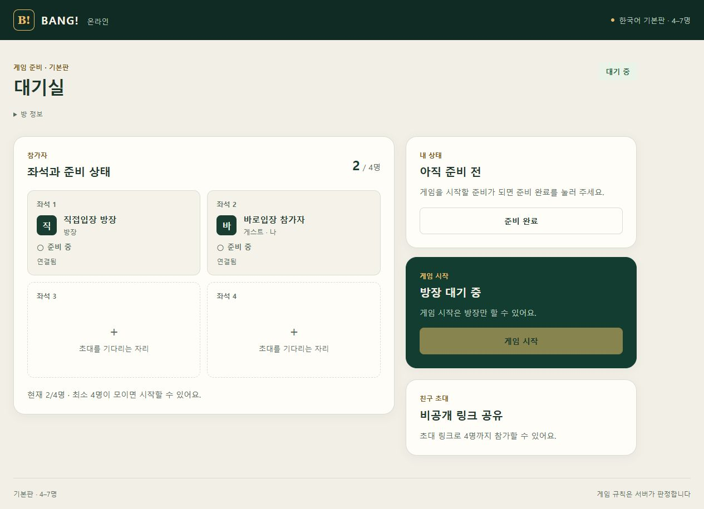

# 대기실 직접 입장 변경

## 사용자 흐름

- 방 생성 완료 즉시 대기실로 이동한다. 별도 `대기실 열기` 버튼을 제거했다.
- 초대 링크를 열면 기존 게스트는 자동 입장한다. 처음 방문한 게스트는 이름만 입력하고 `대기실 입장`을 누른다.
- 링크가 없는 참가 화면에서는 전체 링크를 붙여 넣고 한 번 제출한다. 초대 코드 입력과 방 미리보기 확인 화면을 제거했다.
- 초대 링크 공유는 대기실에 있다.

## 구현과 오류 처리

기존 계약의 초대 조회 → 버전이 포함된 JOIN 요청은 내부에서 연속 실행한다. 사용자가 확인해야 하는 중간 단계를 제거한 것이며, API를 하나로 합쳤거나 네트워크 지연 자체를 줄였다는 의미는 아니다. 기본판 규칙과 서버·DB 계약은 변경하지 않았다.

입장 중 중복 제출은 같은 Promise를 사용한다. 결과가 불명확한 통신 오류의 재시도는 같은 commandId와 요청 본문을 유지한다. 확정적인 STALE_VERSION은 새 버전과 ID로 최대 두 번 재시도한다. 이미 참가한 좌석은 인증된 방 목록에서 동일 방의 닫히지 않은 좌석만 복구한다. 잘못된 링크, 정원 초과, 닫힌 방 등은 안전한 안내로 표시한다. 언마운트 후 입장 완료가 발생해도 이전 화면에서 라우팅하지 않는다.

실제 브라우저 검증에서 통신 어댑터가 `REQUEST_REJECTED` 코드와 서버 거절 코드를 message로 전달한다는 것을 확인했다. 이를 처리하도록 수정했으며 실제 BrowserTransportError를 사용하는 회귀 테스트를 추가했다.

## 검증

- 최종 웹 Node 테스트: **144/144 PASS**, 실패·스킵 0. 신규 직접 입장 테스트 11개 포함.
- 웹 및 Sites TypeScript 검사: PASS.
- Sites 최종 빌드와 루트 배포 산출물 생성: 최종 배포 기록 참조.
- 실제 로컬 브라우저: 방 생성 → 대기실 자동 이동 PASS.
- 첫 초대 방문: 이름만 표시 → 제출 → 2/4명 대기실 PASS.
- 동일 초대 링크 재방문: 추가 버튼 없이 기존 좌석으로 자동 이동 PASS, 인원 2명 유지.
- 링크를 직접 붙여 넣기: 한 번 제출 → 대기실 PASS.
- 존재하지 않는 초대 링크: 안전한 오류 안내 PASS.
- 정원 경쟁, 중복 제출, 불명확한 응답, 종료 방·무관한 좌석 복구 차단: 모델 단위 테스트로 검증. 운영에서 새 다인 게임 전체 흐름을 검증한 것으로 기록하지 않는다.

로컬 확인은 localhost와 IPv6 루프백을 별도 게스트 쿠키 호스트로 사용했다. 스크린샷은 실제 로컬 대기실 화면이다. 개발 중 HMR/빌드에 따라 일시 연결 복구 표시와 기존 vinext/React flushSync 경고가 관찰됐다. 이 변경의 검증 결과를 운영 전체 게임이나 개발 프레임워크 경고의 해결로 확대하지 않는다.

원본 수락 검증은 **95/97** 상태를 유지한다. **D06/D18/S09는 NOT RUN**이며 이번 작업으로 통과 처리하지 않았다.

