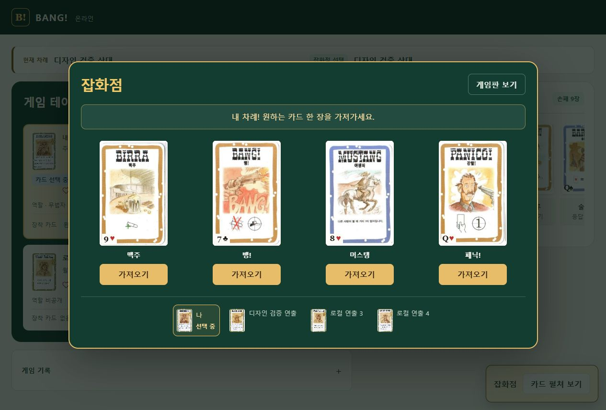
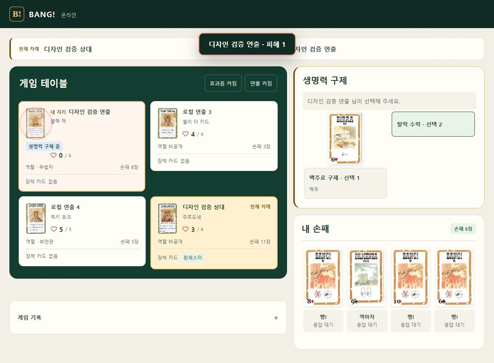
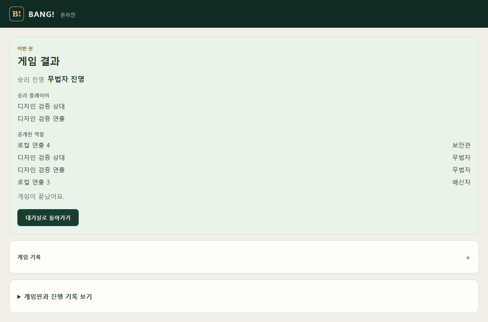

# 전체 게임 과정 검토·보완 결과

2026-10-05 · 혼자 구현. 상세 설계는 `PROCESS_DESIGN.md`, 운영 반영은 `DEPLOYMENT.md`.

## 수정한 항목

| 발견한 부족함·경계 | 보완 |
|---|---|
| 카드 사용 결과가 테이블과 연결되지 않음 | BANG 발사 궤적·총성, Gatling 연사, 성공 방어의 금속음과 대상 강조 |
| 피해·회복·장비·획득·턴 전환이 구분되지 않음 | 공개 이벤트와 상태 변화에 따른 각각의 피드백. 회복 없는 맥주에는 회복 효과 없음 |
| 잡화점이 일반 응답 버튼 목록에 가까움 | 공동 카드 모달, 카드 펼침·획득 효과, 현재 선택자·선택 순서. 다른 사람은 상세 열람만 가능 |
| 공개 선택과 개인 선택이 같은 화면 구조 | Lucky 공개 판정 선택 모달, Kit 본인 전용 선택 모달. 상대 손패·덱 순서는 공개하지 않음 |
| 대상 지정이 행동 패널에 집중됨 | 서버 제안이 정확히 하나로 확정되는 대상은 테이블에서도 선택. 여러 장착 카드 중 선택은 기존 목록 유지 |
| 치명상·탈락 포기가 일반 선택처럼 보임 | 구제·위험 선택 강조, 탈락 포기 2회 클릭 확인 |
| 관전 화면에 빈 손패와 행동 영역이 남음 | 일반 관전자 입력 영역 제거, 공개 테이블 확장. 자기 탈락 카드 버림 순서만 입력 예외 유지 |
| 모바일 바로가기가 남의 대응을 내 응답으로 표시할 수 있음 | 본인 응답자일 때만 내 응답 링크. 일반 관전자에게 손패 링크 없음 |
| 재접속·숨겨진 탭·중복 수신이 소리를 반복할 수 있음 | 최초 연결은 기준 상태만 저장, eventSeq 중복 제거, 오래된 이벤트 제외, 숨겨진 탭 소리·큐 제거 |
| 효과 누적으로 게임 입력이 느려질 우려 | 최대 12개 연출 큐, 단일 오디오 컨텍스트 재사용, 추가 연출 API 요청 없음, 입력은 연출 종료와 무관 |
| 여러 장비 효과의 ID 충돌, 승리/탈락 순서 | 공개 장비별 고유 cue ID, 탈락 뒤 승리 피드백 |
| 선택한 카드가 사라지며 키보드 초점 소실 | 열린 선택 모달 내부로 초점 유지, Escape 최소화와 재진입, 상세 창 초점 복귀 |
| 불필요한 대응 안내 | 일반 응답 대기 문구에서 비공개/진행 상태에 대한 중복 설명 제거 |

공식 게임 규칙·명령 계약·DB 스키마를 변경하지 않았다. 서버 변경은 Panic/Cat 사용 대상의 **공개 표현 이벤트** 추가다. 여기에는 사용한 사람·대상·구역만 포함한다. 비공개 카드 ID·무늬·숫자·덱 순서는 포함하지 않는다. 새로운 외부 음원·애니메이션 라이브러리는 없다.

## 자동 검증

| 검증 | 최종 결과 | 증거 |
|---|---|---|
| 웹 전체 회귀 테스트 | **167/167 PASS**, 실패·스킵 0 | `web-tests-final.tap` |
| 서버 공개 projection | **9/9 PASS** | `server-projections-final.tap` |
| Sites 매치 HTTP/ACK·복구·공개 범위 | **16/16 PASS** | `site-match-tests.tap` |
| 웹 / Sites 타입 검사 | PASS / PASS | tsc 종료 코드 0 |
| 생존자·탈락자 테이블 렌더 | PASS | `table-fixtures.log` |
| Sites 최종 빌드·루트 산출물 | PASS / PASS | `site-build-final.log`, `stage-build.log` |

새 테스트는 연출 이벤트 중복·최초 연결·숨겨진 탭·오래된 이벤트·HP 회복 0·Gatling 대상·Barrel 실패·Slab 부분 방어·잡화점 건너뛴 동기화·큐 한도·종료 순서·장비 ID·오디오 활성화/음소거/미지원·모달 공개 범위·탈락자 카드 정리·관전자 화면을 포함한다.

초기 strip-only 실행에서는 기존 TypeScript parameter property 때문에 테스트 파일 로딩이 실패했다. 지원하는 tsx 실행기로 다시 실행하여 위 최종 결과를 얻었다. 테이블 fixture의 기존 data 속성 전체 금지 검사는 새로 필요한 **공개 좌석 ID만** 허용하도록 좁혔으며, 모든 비공개 sentinel과 다른 data 속성 검사는 유지했다. 초기 실패 로그는 삭제하지 않았다.

## 실제 로컬 브라우저 검증

서로 다른 브라우저 쿠키 호스트 localhost / [::1]의 두 참가자와 로컬 QA 참가자 2명으로 검토했다. 별도 로컬 방에만 80장 보존을 확인하는 통제 fixture를 사용했다. API 자동 참가자는 스스로의 서버 응답 선택지만 제출했다.

- 입장·준비·역할 확인·게임 진입: 직접 UI로 확인.
- BANG: 허용 대상 선택 → 공격 → 상대의 빗나감 → HP 유지·손패 감소. 공격·방어에서 오디오 예약 성공 표식 확인.
- Gatling: 전체 공격 → 첫 상대 피해 → HP 4→3 → 나머지 두 참가자 빗나감 → 일반 행동 복구 확인.
- Beer: HP 3→4와 손패 감소 확인.
- 잡화점: 두 화면 모두 모달 자동 진입, 같은 공개 카드 4장, 대기 참가자에 가져오기 버튼 없음. 설명 이미지 클릭/닫기, Escape 최소화/다시 열기 확인.
- 잡화점: 첫 참가자 머스탱 획득 → 공개 풀 3장·다음 선택자 → 둘째 참가자 맥주 획득 → 나머지 두 참가자 선택 → 모달 종료·각자 손패 증가 확인.
- Cat Balou: 테이블의 상대 선택 → 손패 무작위 버리기 → 대상 손패 감소·대상 연출. 공격자 화면에 버린 비공개 카드 그림 없음.
- Barrel: 카드 사용 후 공개 장착 카드 등장·손패 감소 확인.
- 턴 종료: 손패 8장/HP4 → 초과4장 순서 선택·버리기 → 손패4장·다음 차례와 Black Jack 공개 카드 확인.
- 치명상: HP1 대상에게 실제 BANG → 피해 받기 → HP0 구제 창 → 탈락 수락 첫 클릭은 확인 문구만 변경 → 두 번째 클릭은 역할 공개와 마지막6장 버림 입력 → 입력 완료 후 관전·손패0, 처치자의3장 보상 확인.
- 완료 상태 fixture: 결과·공개 역할·승리 진영 확인, 일반 행동 없음. 방장 대기실 복귀를 실제로 실행하여 준비 상태 초기화 확인.

## 제한을 남긴 항목

- 375px 뷰포트 요청이 현재 브라우저에서 실제 DOM 크기에 반영되지 않아 이번 새 모달의 모바일 실측은 **미검증**이다. 실제 측정값은 1280×720이었다. 모바일 CSS와 바로가기 렌더 테스트는 완료했지만 이를 모바일 브라우저 검증으로 기록하지 않는다. `store-observer.png`는 데스크톱 관전자 화면이다.
- 오디오 노드 예약·음소거·타이밍을 검증했다. 실제 스피커의 음량·음색을 사람이 청취하여 평가한 결과는 아니다.
- 판정·결투·인물 모든 조합을 실제 브라우저에서 새로 플레이하지 않았다. 자동 모델/공개 범위 테스트와 기존 엔진 판정을 적용했다. 이번 작업에서 새 전체 엔진 벤치마크나 운영 장시간 플레이는 실행하지 않았다.
- 기존 vinext 개발 환경의 flushSync 경고와 빌드의 동적 경로 분류 안내가 남는다. 빌드는 성공했지만 콘솔이 완전히 깨끗하다고 주장하지 않는다.
- 원본 수락 집계 **95/97**, **D06/D18/S09 NOT RUN**은 그대로다. 이번 회귀 테스트나 통제 fixture를 원본 케이스 통과로 승격하지 않았다.

## 대표 화면

