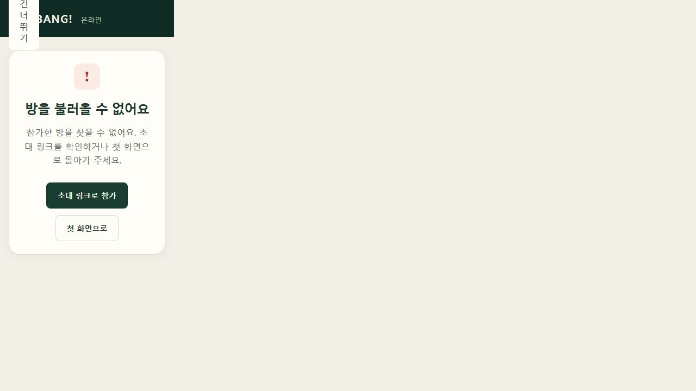

# 7개 로직 문제 수정 결과

작업일: 2026-10-06 KST · 단독 작업

이 문서는 이전 검토 당시의 [REPORT.md](REPORT.md)에 대한 후속 수정 기록이다. 이전 보고서의 재현 결과와 실패 수치는 수정 전 상태다.

## 적용 내용

| ID | 수정 내용 | 검증 |
|---|---|---|
| A01 | SSE 연결 여부와 별개로 실패한 room/match 조회를 제한된 지수 지연으로 자동 재시도. 5xx는 연결 오류로 구분. 숨김·구독 해제·권한 상실·종료 시 재시도 중단 | 1회 500 후 추가 이벤트 없이 복구, 재시도 종료 조건 테스트 |
| A02 | 빠른 ACK에 이벤트 기준 커서 `baseEventSeq` 추가. 클라이언트의 수신 커서와 이어질 때만 즉시 적용하고, 중간 이벤트가 있으면 기존 커서부터 보충 조회 | 실제 D1 → HTTP → transport 동시 인디언 응답에서 앞선 피해 기록 보존 |
| A03 | 이미 받은 초대 링크를 게스트별로 브라우저에 보존. 링크를 받지 못한 방장은 현재 대기실에서 새 링크 발급 가능 | 저장소 복구·오류 처리, D1 소유권·상태·동시 발급 검사. 브라우저 새로고침 후 동일 링크 및 새 발급 확인 |
| A04 | 결투 응사 이벤트에 실제 상대 ID를 명시하고 공개 projection에 전달. 과거 이벤트도 자기 자신을 겨냥하지 않도록 처리 | 실제 엔진으로 양측 4회 응사 → 공개 DTO → 연출의 actor/target 확인 |
| A05 | 소속 상실이 확인된 방과 연결 게임의 캐시·구독을 해제. 이후 정상 조회가 다른 곳에서 성공해도 참가 종료 화면 유지. 정상 JOIN 후 접근 복구 | transport 캐시/구독/재가입 검사, 두 독립 브라우저 실제 강퇴 화면 확인 |
| A06 | 복구 목록에서 닫힌 방 제외. 좌석 목록 복구가 전체 방 구독으로 이어지지 않도록 변경. 현재 경로/명시적 관찰 대상만 실시간 구독 | 과거/닫힌 방 구독 및 추가 조회가 생기지 않는 transport 테스트, D1 복구 목록 검사 |
| A07 | 미래 `retryAt`까지 초대 조회 거절. 15분 유휴 초기화를 예약 시점에도 적용 | 고정 시계 D1 테스트로 대기 경계, 성공 초기화, 유휴 후 초기 지연 확인 |

초대 재발급은 **기존 링크를 만료시키며 참가자는 유지**한다. 화면에 이 정책을 안내하고 처리 중 버튼을 비활성화했다. 서버에는 기존처럼 초대 토큰의 hash만 저장한다. 브라우저 저장이 불가능해도 참가 및 게임 진행은 계속 가능하다.

일반 ACK의 즉시 반영 경로는 유지했다. 비공개 이벤트 때문에 생기는 정상 seq 공백을 공개 기록 유실로 취급하지 않는다. 권한 상실과 일시적인 서버 오류도 구분한다.

## 함께 갱신한 기존 테스트

A08의 Node 런타임 테스트 2개를 현재 D12 자동 준비 정책에 맞게 갱신했다. 자동 준비 `true`의 no-op은 버전/알림을 만들지 않으며, 최소 4명이 모이면 시작하고 대기실 복귀 후 바로 다시 시작할 수 있음을 검증한다. 시작 인원 부족과 게임 중 강퇴 거절 검사는 유지했다. 해당 런타임 테스트 4개 모두 통과했다.

## 검증 기록

- 새 D1/HTTP 통합 및 세션·방 테스트 11개 통과.
- 계약·카탈로그·엔진·Node 서버·웹·Sites의 6개 TypeScript 프로젝트 검사 통과.
- Vinext production 빌드 및 루트 Worker/client/D1 산출물 검사 통과.
- 최종 계약·카탈로그·엔진·Node 서버·Sites·웹 회귀 검사: **799개 PASS / 0 FAIL / 0 SKIP**. 실행 로그: `logs/fix-regression-final.log`.
- 로컬 두 브라우저에서 초대 링크 보존·재발급·참가·강퇴 후 화면 전환 확인.
- 상세 실행 로그는 로컬 `logs/`에 보존하며 운영 배포 산출물에는 포함하지 않는다.

## 범위와 미검증 상태

기본판 규칙과 명시적 구현 결정은 유지했다. 기존 수락 집계 95/97, D06/D18 및 운영 S09의 미검증 상태를 승격하지 않는다. 이번 회귀 검사를 운영 4/7인 독립 브라우저 전체 게임이나 대규모 부하 검증으로 대신하지 않는다.

A09 시드 치명상 구제 옵션 수는 별도 성능 개선 후보이며 이번 요청의 7개 결함에 포함되지 않는다.
