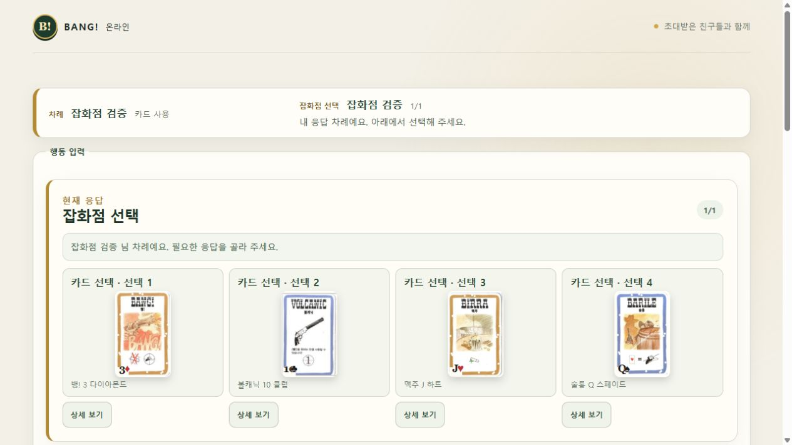
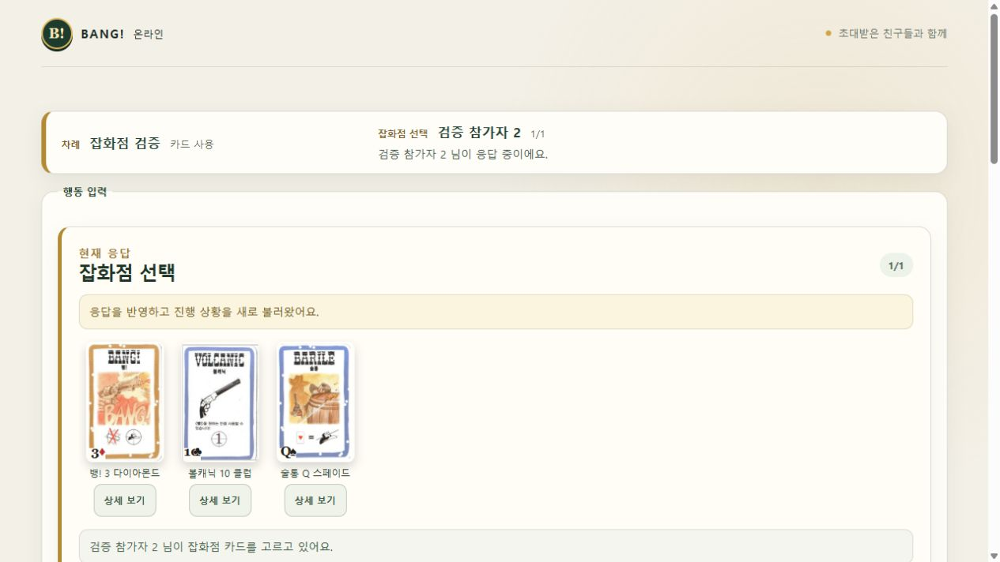

# 잡화점 카드 이름 누락 수정 — 2026-10-04

## 원인과 변경

잡화점은 R17에 따라 남은 공개 카드 중에서 고르는 기능입니다. 기존 화면은 선택 카드 ID를 본인 손패에서만 찾았고, 서버 snapshot에는 잡화점 공개 카드 정보가 없어서 이름 대신 선택 번호만 표시됐습니다.

- `publicTable.generalStoreCards`에 남은 카드의 ID·종류·숫자·무늬를 전달합니다. `GENERAL_STORE_PICK` 중에만 존재합니다.
- 선택 화면에 한국어 이름, 카드 이미지, 숫자·무늬, 확대 상세 보기를 표시합니다.
- 기다리는 참가자도 남은 공개 카드를 볼 수 있습니다. 선택된 카드는 목록에서 제거됩니다.
- 기존 합법 RESPOND payload와 게임 규칙은 그대로 적용합니다. 킷 칼슨·럭키 듀크의 개인 선택이나 타인 손패는 공개하지 않습니다. DB 및 적용된 마이그레이션은 변경하지 않았습니다.

## 검증

`node scripts/verify-general-store.mjs`의 최종 [verification.json](verification.json)은 PASS입니다.

| 범위 | 결과 |
| --- | --- |
| 계약 테스트 | 21/21 |
| 엔진 전체 회귀 | 367/367 |
| Site match HTTP 테스트 | 14/14 |
| 웹 전체 회귀 | 118/118 |
| 합계 | 520/520 |
| 계약·엔진·Node 서버·웹·Site 타입 검사 | PASS |
| Site 빌드 및 배포 출력 준비 | PASS |

실제 로컬 Worker/D1과 브라우저에서 4인 방을 만들고, 로컬 전용 상태 fixture로 잡화점 사용을 준비했습니다. 카드 4장(뱅!·볼캐닉·맥주·술통)의 이름·이미지·숫자·무늬, 맥주 상세 확대, 맥주 선택 후 3장의 대기 화면을 확인했습니다. 운영 DB에 검증 fixture를 넣지 않았습니다.

첫 실행의 Windows loader 오류와 이어진 기존 테스트 fixture의 공개 범위 가정 오류는 `initial-*` 기록에 남겨두었습니다. 기존 공용 privacy fixture가 잡화점까지 개인 카드로 간주한 부분을 R17에 맞게 고쳤으며, 모든 좌석의 공개 카드 목록을 정확히 비교하고 개인 선택·손패 비공개 검사는 유지했습니다. 최종 테스트는 변경을 마친 뒤 처음부터 다시 실행했고 입력 fingerprint가 동일한지 확인했습니다.

이번 수정에서는 전체 Node 서버 테스트와 전체 D1 저장소 테스트를 다시 실행하지 않았습니다. 원래 통합 수락 95/97, D06/D18 NOT RUN 및 운영 전체 브라우저 대국 S09 NOT RUN을 유지합니다. 520개는 이번 수정에서 실제 실행한 테스트 수입니다.

## 적용

기존 public Site에 **버전 5 게시가 성공**했습니다(2026-10-04T12:22:08Z). 소스 `15566e1a32efdbff06cb05df10a909a6ac098f5a`는 GitHub main에도 업로드됐습니다. 이전 프런트엔드의 엄격한 snapshot parser는 추가 필드를 처리하지 못하므로 열린 탭은 한 번 새로고침해야 합니다. [게시 결과](deployment-result.json)에 정확한 버전·배포·소스 식별자를 기록했습니다.
