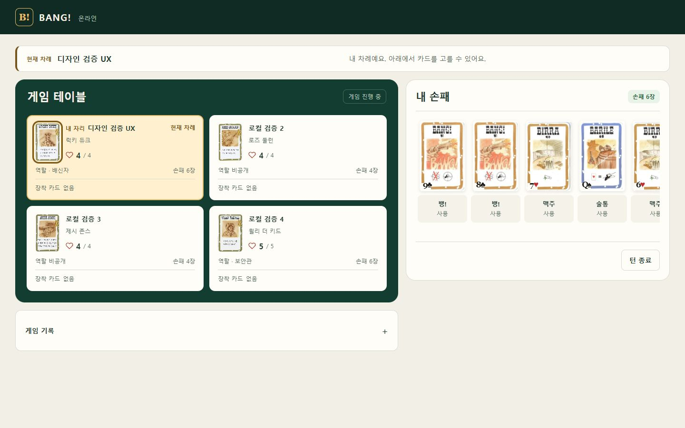
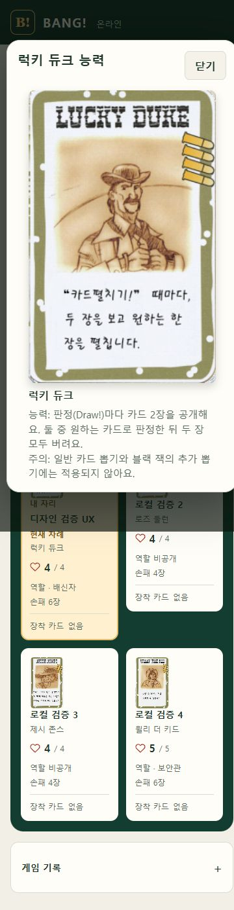

# 게임 화면 UX 정리 · 2026-10-05

## 변경

- 손패·응답·잡화점 카드 이미지를 누르면 설명을 연다. 카드 사용·선택 버튼은 별도로 유지해 설명을 보다가 행동이 실행되지 않는다.
- 공개 캐릭터 이미지와 역할 확인 화면의 캐릭터 이미지를 누르면 기존 규칙 정본의 능력 설명을 연다. 7인 모바일에서도 이미지를 표시한다.
- 정상 행동 완료·상태 동기화 성공 알림과 명령 ID 설명을 제거했다. 처리 중 표시와 오류 후 재확인만 남긴다.
- 남은 덱·버림더미, 중복 차례 표시, 상단 인원 문구와 서버 판정 안내를 제거했다. 진행 기록은 접힌 상태로 제공한다.
- 이미지가 있는 카드 목록은 카드 이름만 표시한다. 접근성 이름에는 카드 숫자·문양을 유지한다. 이미지가 없는 시드 비용 선택 메뉴는 같은 이름의 실물 카드를 구분하도록 숫자·문양을 유지한다.
- 턴 종료의 손패 제한은 `초과 카드 버리기`로 표시한다. 버릴 수와 남은 체력 기준을 설명하고, 버리기 중 손패가 두 번 표시되지 않게 했다. 카드 버리기 템플릿의 빈 응답 목록도 제거했다.
- 카드 호버·선택·등장, 체력 변화, 차례 표시와 설명 팝업에 짧은 CSS 애니메이션을 추가했다. 동작 줄이기 설정에서는 비활성화한다. 애니메이션 라이브러리를 추가하지 않았다.

서버 게임 규칙·계약·DB는 변경하지 않았다. 만피 맥주는 기존 정책대로 사용 가능하며 회복 없는 사용에 대한 확인을 유지한다.

## 검증

- 웹 Node 테스트 **147/147 PASS**, 실패·스킵 0. 이미지 설명 진입, 공개 캐릭터 접근성, 턴 종료 버리기 안내 회귀 테스트 포함.
- 웹/Sites TypeScript 검사 PASS. 생존자·탈락자 projection 렌더 검사 PASS. Sites 빌드 및 배포 산출물 생성 PASS.
- 실제 로컬 브라우저: 손패 이미지 설명, 역할 확인·게임판 캐릭터 능력 설명, Escape 닫기와 초점 복귀 PASS. 설명을 열어도 게임 버전이 바뀌지 않았다.
- 실제 UI로 술통 사용 후 장착·손패 감소, 초과 1장 버리기 후 손패 4장과 다음 차례 전환을 확인했다. 정상 성공 알림과 중복 실행 안내가 표시되지 않았다.
- 잡화점 사용 → 카드 이름·이미지 표시 → 이미지로 설명 열기 → 별도 선택 버튼으로 스코필드 획득 → 다음 참가자 선택 전환 PASS.
- 4인·7인 각각 375/768/1024/1440px에서 페이지 가로 넘침 없음. 캐릭터 클릭 영역 최소 52×78px. 7인 모바일의 시드 능력 팝업을 실제로 열었다. 측정 결과는 `responsive-checks.json`에 있다.

카드 행동 검증은 별도 로컬 방과 80장 보존을 확인하는 통제된 fixture를 사용했다. 운영 전체 게임 완료나 모든 원본 수락 케이스의 검증을 뜻하지 않는다. 원본 수락 기록의 **95/97** 상태와 **D06/D18/S09 NOT RUN**을 유지한다. 기존 vinext 개발 경고는 이번 UI 수정의 해결 대상으로 기록하지 않는다.

## 화면

운영 버전·커밋과 배포 완료 근거는 `DEPLOYMENT.md`에 기록한다.
